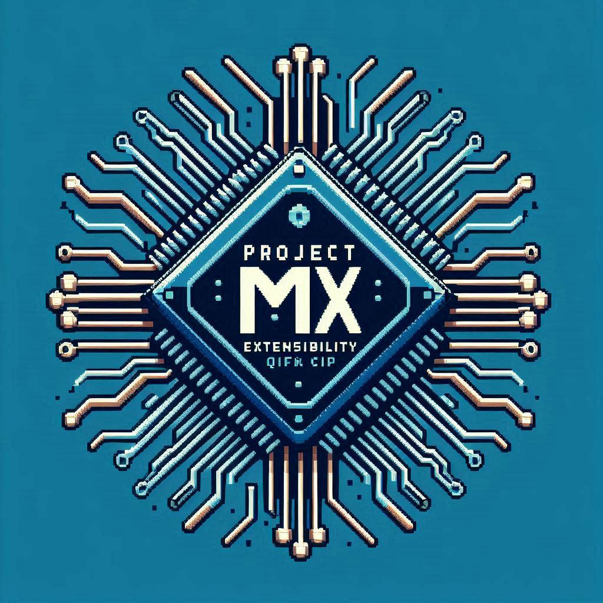

# Project MX
The "simple" 8-bit machine
## MX11SU Architecture
||
|:-:|
| *MX11SU Architecture* |
---
This is a Harvard Computer, where each component is a character in our sitcom, working together to keep the show running smoothly.

1. **Register File**:
   - Think of these registers like your brain's sticky notes. Each one has a special job, like holding onto data or addresses. They're the processor's little helpers, always ready to jot down a quick note. You could say they're the "write" stuff!

2. **Scalar Execution Unit**:
   - This unit handles all the single data point operations. It's like the processor's personal trainer, making sure it stays fit with arithmetic and logical exercises. When it comes to crunching numbers, this unit doesn't skip "leg day"!

3. **Barrel Shift Unit**:
   - This one's all about bit-shifting. Imagine you're rearranging your sock drawer, but with bits. It helps with multiplying, dividing, and other bit-level magic. It's the processor's very own "shift manager", making sure everything is in its right place!

4. **Load Store Unit**:
   - This is the processor's personal assistant, managing data transfers between the processor and memory. It makes sure everything's where it needs to be. Think of it as the processor's "mover and shaker", always on the go to keep things running smoothly!

5. **Instruction Set Architecture Micro-Code ROM**:
   - This is like the processor's secret playbook, full of low-level instructions that tell it exactly what to do. It's the processor's "little cook book", full of all the moves it needs to impress!

6. **Extension Device Interface**:
   - This is the processor's social butterfly, connecting it to all the extension devices. It's the life of the party, always making new connections and keeping the processor in the loop!

7. **Interrupt Control Unit**:
   - This one's the bouncer, handling all the interrupt signals and making sure the processor deals with important events right away. It's the processor's "gatekeeper", making sure only the most important guests get the VIP treatment! or not!

## ALU
Ah, the MXALU11U—a delightful homage to the venerable Intel 74181. Naturally, it employs two of these classic units in tandem to conjure up a splendid 8-bit ALU configuration. But wait, there's more! A Carry Lookahead (CLA) unit is thoughtfully included, just in case future expansions tickle your fancy. It gracefully handles the usual repertoire of logical and arithmetic operations, of course. And where does this marvel of computational prowess reside? Why, in the Scalar Execution Unit (SEU), where all distinguished ALUs of note are found!

### ALU ROM
| INSTR | OPCODE | DESCRIPTION | M | ~Cn | S |
|-------|--------|-------------|---|-----|---|
| BUF   | 0      | A           | 1 | X   | F |
| NOT   | 1      | ~A          | 1 | X   | 0 |
| NAND  | 2      | A~&B        | 1 | X   | 4 |
| XOR   | 3      | A^B         | 1 | X   | 6 |
| XNOR  | 4      | A~^B        | 1 | X   | 9 |
| AND   | 5      | A&B         | 1 | X   | B |
| OR    | 6      | A\|B        | 1 | X   | E |
| NOR   | 7      | A~\|B       | 1 | X   | 1 |
| ADD   | 8      | A+B         | 0 | 1   | 9 |
| ADC   | 9      | A+B+1       | 0 | 0   | 9 |
| SUB   | A      | A-B         | 0 | 0   | 6 |
| SBB   | B      | A-B-1       | 0 | 1   | 6 |
| INCR  | C      | A+1         | 0 | 0   | 0 |
| DECR  | D      | A-1         | 0 | 1   | F |
| X2    | E      | A + A       | 0 | 1   | C |
| CLR   | F      | 0           | 1 | X   | 3 |


## Register File

So, get this—register banks, right? They’re like the VIPs of the processor world when you’re working with something this small. I mean, the whole operation is basically riding on these little data highways doing their thing. Every single register? It’s got a name, it’s got a job, it’s living its best life. But hey, they can still moonlight as general-purpose ones when needed, right?
```Pandoc
                0x0                      0x8
    +------------------------+------------------------+
0x0 |            A           |            SA          |
    +------------------------+------------------------+
0x1 |            X           |            SX          |
    +------------------------+------------------------+
0x2 |            Y           |            SY          |
    +------------------------+------------------------+
0x3 |            D           |            SD          |
    +------------------------+------------------------+
0x4 |           DAR          |            R0          |
    +------------------------+------------------------+
0x5 |           MBR          |            R1          |
    +------------------------+------------------------+
0x6 |          INSP          |            R2          |
    +------------------------+------------------------+
0x7 |         FLAGS          |            R3          |
    +------------------------+------------------------+
```

- **A**
	- Alright, listen up—this Accumulator thing, or "A" if you're feeling fancy, is like the workhorse of the whole setup. It’s the one dealing with most of the SEU operations, handling all the heavy lifting when it comes to crunching numbers and whatnot. And when it's done? It just stores the results like, "Yeah, I did that." You wanna talk about important? Without the Accumulator, the rest of the processor's just sittin’ there twiddling its thumbs, waiting for something to happen. So yeah, it’s kinda a big deal.
- **X and Y**
	- Let me break it down for you: the General Purpose Registers X and Y, or GPRs, are like the processor's personal assistants. They’re where you stash all the values that need a little processing magic. Think of them as the processor's filing cabinets, but way less high-tech. Whenever the user needs to do some heavy lifting with data, it grabs what it needs and shoves it into X or Y. They are the trusty side-kicks of A.
- **D**
	- Ah, the Data Register, or "D" darling. It’s rather pivotal, you see. This little gem is responsible for holding those ever-so-important addresses for load and store operations—essentially keeping track of where the data is plucked from or deposited into memory. But wait, there's more! The Data Register isn’t just lounging around, twiddling its digital thumbs. It also gets in on the action with the Scalar Execution Unit (SEU). Yes, that means it’s not merely a passive repository; it’s actively involved in various computations and manipulations. So, while it’s busy managing addresses, it’s also a key player in the grand ballet of processing tasks. Quite the versatile little fellow, wouldn’t you agree?
- **Shadow Registers**
	- Ah, the shadow registers! Imagine, if you will, a scenario straight out of a top-secret mission. These shadowy figures, much like the elusive Zilog Z80 microprocessor, are the unsung heroes of the digital world. They stealthily hold the values of the A (accumulator), and the general-purpose registers (GPRs) X and Y, along with the D (data register). 
	- Now, picture this: in the blink of an eye, these shadow registers spring into action, executing quick context switches with the finesse of a seasoned spy. They save and restore the state of these critical registers with such efficiency that it would make even the most hardened villain tremble. By storing the contents of these registers in their shadowy depths, the processor can seamlessly switch between different tasks or states, avoiding the tedious and time-consuming save and restore operations on the main registers. The result? Enhanced performance and responsiveness that would leave any adversary in awe. Quite the clever trick, wouldn't you say?

- **DAR and MBR**
	- Alright, so check this out! The Device Address Register—yeah, the DAR—and the Memory Buffer Register, or MBR (I know, sounds fancy), are kinda like the tag-team champs of your machine cycle. The DAR’s holding down the address of the device you wanna talk to, while the MBR’s got the goods—the control data—if the device needs it. Now here’s the kicker, after the device finishes doing its thing, it’s gotta have, like, a special move to reset the DAR and give up control. You know, like, “I’m done, DAR, peace out!"

- **INSP**
	- Alright, so here’s the deal with the Instruction Pointer, or INSP. It’s basically holding onto the address of the next instruction the processor’s gotta fetch in the current machine cycle. And when things are running smoothly, after each fetch, the INSP bumps up to the next address, like clockwork. Just keeps moving things along, no drama, no fuss—unless something screws it up, which happens, let’s be real.

- **FLAGS**
	- Alright, brace yourself for some flag talk! So, the flags register is where all the action happens. The lower 5 bits? Yeah, those are reserved for the ALU flags. We’re talking Zero (Z), Carry (C), Equal (E), Less Than (L), and Greater Than (G)—basically your go-to guys for comparisons. And the MSB? That’s the Interrupt Enable flag, just sitting up there, making sure everything's ready to handle interrupts like a boss. Cool, right?
```Pandoc
FLAGS
+---+---+---+---+---+---+---+---+
| I |   |   | G | L | E | C | Z |
+---+---+---+---+---+---+---+---+

I - Interrupt Enable
G - Greater Than
L - Less Than
E - Equal
C - Carry
Z - Zero
```
- **Numbered GPR**
	- Okay, so like, these numbered registers, R0 through R3, are kinda like the Swiss Army knives of the processor, right? They can do all sorts of stuff depending on what you need. They can be shadow registers, which is like them being all secretive and backing up other registers, or they can just hold onto things temporarily, like when you’re not sure where else to put stuff. Basically, they're super handy and can multitask like a pro!